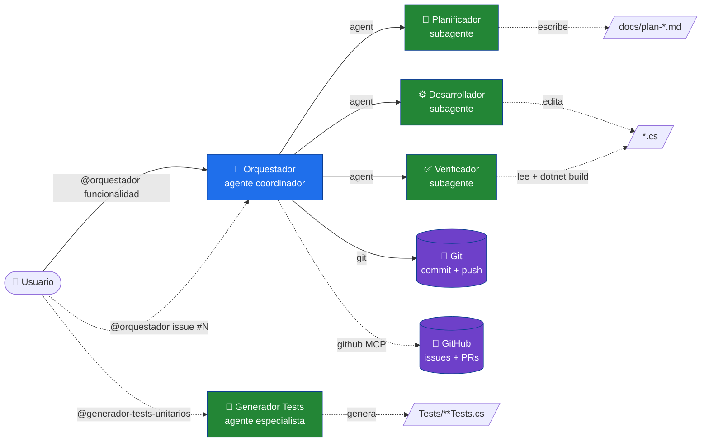
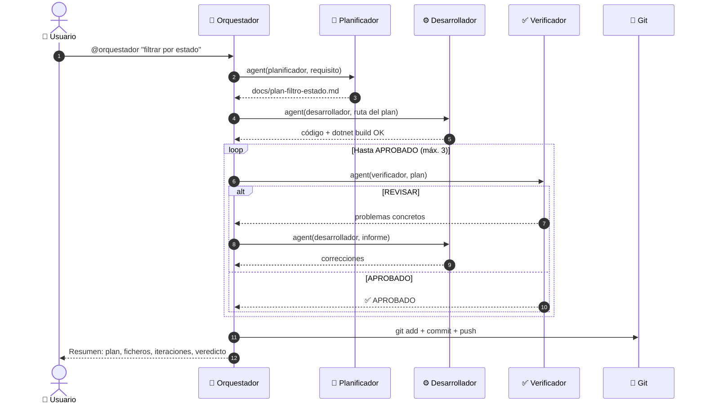
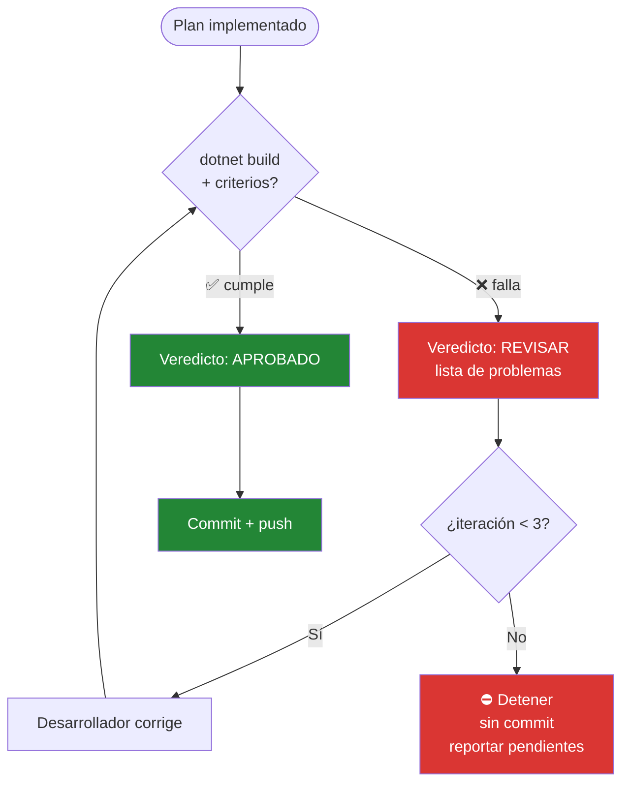
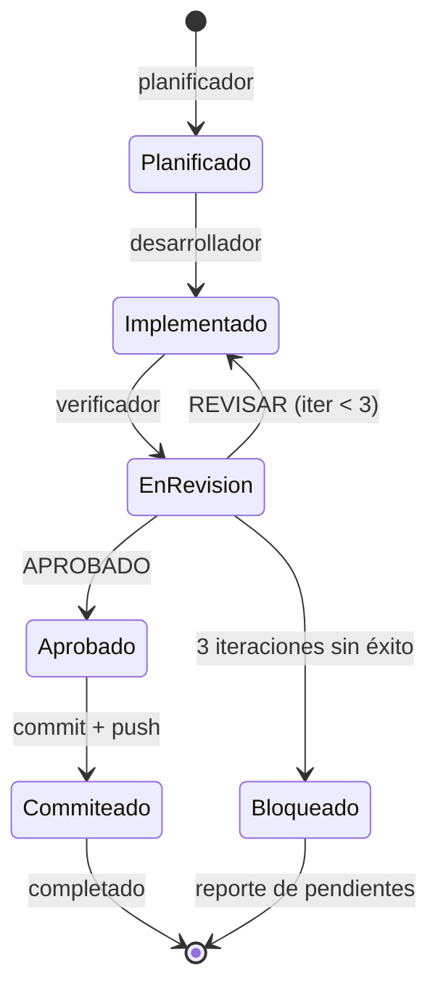
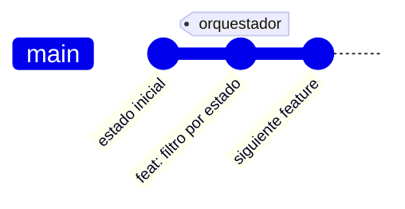
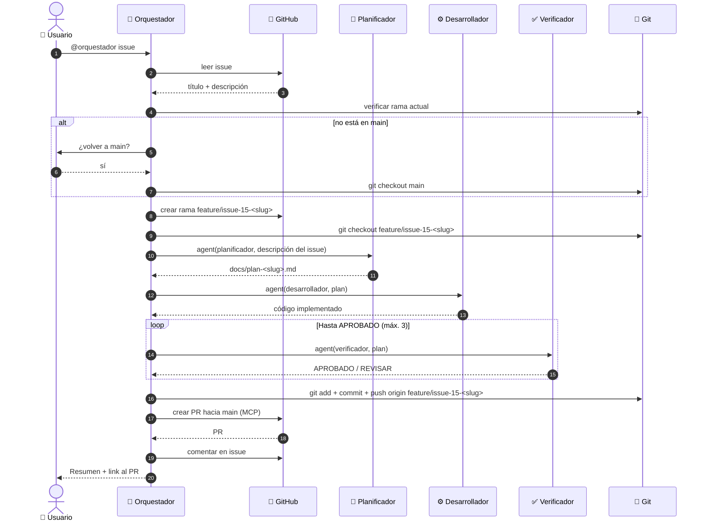
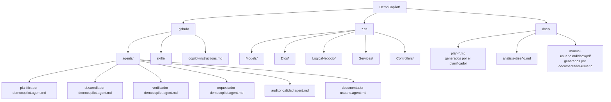

# El equipo de agentes coordinados (en GitHub Copilot)

Ampliar una API a mano tiene un ritmo conocido: piensas qué hay que hacer, lo escribes, compruebas que no has roto nada y lo subes. Cuatro sombreros distintos puestos por la misma persona. Aquí cada sombrero es un agente, y tú solo das la orden de salida con `@orquestador-democopilot`. El resto — el plan, el código, la verificación y el commit — pasa solo.

Este documento cuenta cómo está montado por dentro y por qué se tomó cada decisión.

---

## 1. El mapa, de un vistazo

Tú hablas con uno solo. Ese uno reparte.



El orquestador es el único que toca Git. Los tres especialistas ni se enteran de que se va a hacer commit: lo suyo es leer, planear, escribir código y dar un veredicto. Esa separación es a propósito, y enseguida verás por qué importa.

---

## 2. Quién hace qué

| Rol | Qué es en GitHub Copilot | ¿Toca código? | Herramientas | Lo que deja |
|-----|---------------------|---------------|--------------|------------|
| **Orquestador** | Agente `@orquestador-democopilot` | No | `agent, execute, read, search` | Commit + resumen |
| **Planificador** | Agente `@planificador-democopilot` | Solo el plan `.md` | `read, search, edit` | `docs/plan-<slug>.md` |
| **Desarrollador** | Agente `@desarrollador-democopilot` | Sí | `read, search, edit, execute` | Código que compila |
| **Verificador** | Agente `@verificador-democopilot` | No | `read, search, execute` | Veredicto APROBADO / REVISAR |
| **Generador de tests** | Agente `@generador-tests-unitarios` | Sí (solo tests) | `read, search, edit, execute` | Tests unitarios (xUnit + Moq) |
| **Auditor de calidad** | Agente `@auditor-calidad` | No | `read, search, github` | Informe + issues de GitHub (si MCP configurado) |
| **Documentador de usuario** | Agente `@documentador-usuario` | No | `read, search, edit, terminal` | Manual de usuario (.md/.docx/.pdf) |

Fíjate en una cosa: el planificador y el verificador **no escriben código de producción**. El planificador solo deja un `.md`; el verificador solo lee y compila. Es la versión software del principio de que quien diseña el examen no debería ser quien lo aprueba. El que verifica no arregla — señala. Y el que arregla es siempre el desarrollador.

---

## 3. El ciclo completo, paso a paso

Esto es lo que ocurre desde que invocas `@orquestador-democopilot` hasta que tienes el código commiteado en main.



El flujo es deliberadamente simple: no crea issues ni PRs automáticamente. El commit va directo a `main` (o la rama en la que estés). La trazabilidad queda en el plan `.md` y en el historial de Git.

### Los 5 pasos en texto (por si el diagrama no te renderiza)

Si tu visor no pinta el diagrama de arriba, aquí tienes lo mismo en plano. Cada paso, con la acción real que ejecuta cada agente:

| # | Paso | Quién | Acción |
|---|------|-------|--------|
| 1 | **Planificar** | Planificador | escribe `docs/plan-<slug>.md` y devuelve su ruta |
| 2 | **Implementar** | Desarrollador | edita el código según el plan + `dotnet build` |
| 3 | **Verificar** | Verificador | `dotnet build` + criterios → `APROBADO` / `REVISAR` (bucle, máx. 3) |
| 4 | **Commit + push** | Orquestador | `git add .` → `git commit -m "feat: …"` → `git push` |
| 5 | **Resumen** | Orquestador | plan, ficheros modificados, iteraciones y veredicto |

La única acción de Git — **commit + push** (paso 4) — la hace siempre el orquestador con `git`. Los subagentes no tocan nada de eso.

---

## 4. El bucle de verificación (donde está la gracia)

Un control de calidad que solo aprueba o suspende sirve de poco. Este devuelve el trabajo con la lista de qué falla, y el desarrollador vuelve a entrar. Hasta tres vueltas.



¿Y por qué tres y no infinitas? Porque un bucle sin tope es la receta para que un malentendido entre el plan y la implementación te queme la tarde dando vueltas. Si tras tres intentos el verificador sigue diciendo REVISAR, el orquestador **para y no hace commit**. Deja el código sin commitear, te cuenta qué quedó pendiente, y decides tú. Mejor un freno honesto que un commit roto con tu nombre.

---

## 5. La vida de una funcionalidad, como estados

Si prefieres verlo como una máquina de estados — de dónde sale, a dónde puede ir cada paso:



Hay dos salidas, no una. La feliz (commiteado y pusheado) y la honesta (bloqueado, con el parte de lo que falta). Las dos son finales válidos.

---

## 5.5. El auditor de calidad — vigilancia más allá del flujo normal

El `@auditor-calidad` está **fuera del ciclo de desarrollo normal**. No lo llama el orquestador. Lo llamas tú cuando quieres una auditoría exhaustiva: code smells, deuda técnica, violaciones SOLID, problemas de arquitectura de capas, seguridad OWASP, patrones N+1 en EF Core, uso incorrecto de async/await, y más.

### Qué hace

1. **Compila el proyecto** — si falla, veredicto automático: RECHAZADO
2. **Ejecuta tests** — anota cuántos pasan/fallan
3. **Audita arquitectura de capas** — verifica que Controllers → Services → LogicaNegocio → DbContext
4. **Busca code smells** — métodos largos, clases God, duplicación, nomenclatura inconsistente
5. **Analiza async/await** — detecta `.Result`, `.Wait()`, `async void`, fire-and-forget
6. **Revisa EF Core** — N+1 queries, falta de `AsNoTracking()`, `SaveChangesAsync()` repetido
7. **Auditoría de seguridad OWASP** — injection, credenciales en código, endpoints sin `[Authorize]`
8. **Correlaciona con skills** — si encuentra `docs/plan-*.md`, identifica qué skill generó cada fichero con problemas
9. **Detecta patrones sistemáticos** — si el mismo problema aparece en múltiples ficheros del mismo skill, propone mejoras al skill

### Qué deja

- **Informe en markdown:** `docs/auditoria-YYYY-MM-DD.md` con hallazgos priorizados por severidad (🔴 crítico, 🟠 alto, 🟡 medio, 🔵 bajo)
- **Issues de GitHub (opcional):** si el MCP de GitHub está configurado, crea automáticamente un issue por cada hallazgo con:
  - Título: `[SEVERIDAD] Categoría — Descripción breve`
  - Cuerpo: documentación completa del hallazgo (descripción, riesgo, acción requerida, skill responsable)
  - Etiquetas según severidad: `["bug", "critical"]` para críticos, `["enhancement", "quality"]` para medios, etc.
  - Si el MCP no está configurado, simplemente omite la creación de issues sin error

### Modo "abogado del diablo"

El auditor **busca problemas, no los justifica**. Su trabajo es ser despiadado. Si hay un problema, lo reporta aunque sea menor. La carga de la prueba es del código, no del auditor.

### Cuándo usarlo

- Antes de releases o entregas importantes
- Después de implementar varias features sin auditoría
- Cuando sospechas deuda técnica acumulada
- Para validar que los skills generan código de calidad consistente

**Ejemplo de invocación:**

```
@auditor-calidad Controllers/
@auditor-calidad Services/TareasService.cs
@auditor-calidad
```

Sin argumento, audita toda la aplicación.

---

## 5.6. El generador de tests unitarios — primer nivel de la pirámide

El `@generador-tests-unitarios` es el agente responsable de crear y mantener las **pruebas unitarias** del proyecto (primer nivel de la pirámide de pruebas). Se invoca automáticamente al terminar una implementación o manualmente cuando necesitas añadir tests.

### Ámbito de responsabilidad

**SOLO pruebas unitarias:**
- ✅ Tests de lógica aislada (Services, LogicaNegocio, métodos auxiliares)
- ✅ Tests de Controllers con mocks de dependencias
- ✅ Casos normales, edge cases, validaciones y manejo de errores
- ❌ Tests de integración (base de datos real, HTTP real)
- ❌ Tests E2E (UI, navegador, flujo completo)

### Qué hace

1. **Verifica el proyecto de tests** — crea `AppTodoList.Tests` si no existe, con xUnit + Moq + FluentAssertions
2. **Analiza el código de producción** — identifica qué clases tienen tests y cuáles no
3. **Genera los tests faltantes** — crea ficheros `{ClaseTesteada}Tests.cs` en `Tests/`
4. **Sigue el patrón AAA** — Arrange-Act-Assert en todos los tests
5. **Cubre casos críticos** — caso feliz, edge cases, validaciones, null/no encontrado, manejo de errores
6. **Ejecuta los tests** — `dotnet build` + `dotnet test` antes de reportar
7. **Reporta cobertura** — informa al usuario de los tests creados y resultados

### Estructura de tests generados

```
Tests/
├── Controllers/
│   ├── TareasControllerTests.cs
│   └── CategoriasControllerTests.cs
├── Services/
│   ├── TodoServiceTests.cs
│   └── CategoriaServiceTests.cs
└── LogicaNegocio/
    ├── TodoLogicaTests.cs
    └── CategoriaLogicaTests.cs
```

### Convenciones de nomenclatura

- **Fichero**: `{ClaseTesteada}Tests.cs`
- **Clase**: `{ClaseTesteada}Tests`
- **Métodos**: `{MétodoTesteado}_{Escenario}_{ResultadoEsperado}`

Ejemplo:
```csharp
[Fact]
public async Task ObtenerPorId_CuandoExiste_DevuelveTarea()
{
    // Arrange
    var mockLogica = new Mock<ITodoLogica>();
    mockLogica.Setup(x => x.ObtenerPorIdAsync(1))
              .ReturnsAsync(new TodoItem { Id = 1, Title = "Test" });
    var service = new TodoService(mockLogica.Object);

    // Act
    var resultado = await service.ObtenerPorIdAsync(1);

    // Assert
    resultado.Should().NotBeNull();
    resultado.Title.Should().Be("Test");
}
```

### Cuándo usarlo

- Después de implementar una feature nueva (cada feature lleva sus tests)
- Al detectar código sin tests (cobertura baja)
- Al refactorizar código existente (validar que el comportamiento no cambia)
- Como parte del ciclo de CI/CD (los tests deben pasar antes de merge)

**Ejemplo de invocación:**

```
# Generar todos los tests faltantes
@generador-tests-unitarios

# Tests solo para una clase
@generador-tests-unitarios TodoService

# Tests de toda una capa
@generador-tests-unitarios Services/
```

### Integración con el flujo de desarrollo

El generador de tests **NO está en el ciclo principal del orquestador** (planificar → desarrollar → verificar → commit). Se invoca en uno de estos momentos:

1. **Manualmente por el usuario** — después de una implementación
2. **Por el desarrollador** — al terminar de implementar un plan
3. **Por el verificador** — si detecta falta de tests, puede recomendarlo
4. **Por el orquestador (futuro)** — podría añadirse como paso opcional antes del commit

**Principio clave:** Cada feature nueva lleva sus tests. No crear issues separados para "añadir tests" — van con la feature.

---

## 6. Lo que pasa en Git

El trabajo se commitea directamente en la rama en la que estés (normalmente `main`). No crea branches automáticamente **en modo normal**.



---

## 6.5. Flujo basado en GitHub Issues (opcional)

Cuando invocas al orquestador con `@orquestador-democopilot issue #N` (o simplemente `#N`), entra en **Modo Issue** y ejecuta un flujo completo de desarrollo basado en GitHub Issues:

### Qué cambia en Modo Issue

| Aspecto | Modo Normal | Modo Issue |
|---------|-------------|-----------|
| **Rama** | Usa la actual (normalmente `main`) | Crea rama `feature/issue-N-<slug>` desde `main` |
| **Commit** | Mensaje corto `feat: <descripción>` | Mensaje con referencia al issue (`Closes #N`) |
| **Push** | `git push` (rama actual) | `git push origin feature/issue-N-<slug>` |
| **PR** | No crea | Crea automáticamente hacia `main` |
| **Issue** | No interactúa | Comenta con link al PR |

### Flujo completo en Modo Issue



### Convenciones de nombres

**Ramas feature:**
```
feature/issue-15-indices-fks
feature/issue-8-authorize-endpoints
feature/issue-23-paginacion-tareas
```

Formato: `feature/issue-<N>-<slug>` donde `<slug>` es kebab-case del título del issue.

**Commits:**
```
feat: añadir índices en FKs

Implementa validación de referencias foráneas en TodoItems.
Ver plan completo en docs/plan-indices-fks.md.

Closes #15
```

La palabra clave `Closes #15` vincula automáticamente el commit al issue. Cuando el PR se hace merge, GitHub cierra el issue automáticamente.

### Template de PR generado

El orquestador usa `.github/PULL_REQUEST_TEMPLATE.md` para estructurar el cuerpo del PR:

- **Issue relacionado:** `Closes #N` (vinculación automática)
- **Plan de implementación:** Link a `docs/plan-<slug>.md`
- **Cambios realizados:** Lista de ficheros modificados agrupados por capa (Models, DTOs, Controllers, etc.)
- **Verificación:** Estado del verificador (iteraciones, dotnet build)
- **Checklist pre-merge:** Items para el revisor humano

### ¿Qué pasa si el verificador da REVISAR tras 3 iteraciones?

En Modo Normal, el orquestador para sin hacer commit. En Modo Issue, hace lo siguiente:

1. Commit con mensaje `WIP: issue #N (verificación pendiente)`
2. Push a la rama feature
3. Crea PR en **modo draft** (borrador)
4. Comenta en el issue:
   ```
   ⚠️ Implementación inicial completada pero requiere revisión manual
   
   Pull Request (borrador): #PR_NUMBER
   Plan: docs/plan-<slug>.md
   
   Problemas pendientes:
   - [lista de problemas del verificador]
   ```

De esta forma, el trabajo queda visible en GitHub pero marcado como "necesita atención humana".

### Verificaciones previas

El orquestador verifica:
- **Estás en `main`** antes de crear la rama feature (si no, pregunta si quieres volver)
- **El remote es correcto** con `git remote -v` antes de llamar a GitHub MCP
- **El issue existe y está abierto** antes de continuar

### Skill auxiliar: `github-flow`

Opcionalmente, puedes invocar operaciones de GitHub de forma aislada con el skill:

```
@github-flow leer-issue 15
@github-flow crear-rama 15 indices-fks
@github-flow crear-pr 15 feature/issue-15-indices-fks docs/plan-indices-fks.md
@github-flow comentar-issue 15 "✅ PR creado"
```

El orquestador usa este skill internamente en Modo Issue.

### Requisitos

- **MCP GitHub configurado:** Las herramientas `mcp_github_mcp_se_*` deben estar disponibles
- **Acceso al repositorio:** Debes tener permisos para crear ramas y PRs
- **Git configurado:** `git remote -v` debe devolver `hispafox/DemoCopilot` (o tu fork)

### Cuándo usar Modo Issue vs. Modo Normal

| Situación | Modo recomendado |
|-----------|------------------|
| Desarrollo en solitario, cambios rápidos | **Normal** (commit directo a main) |
| Quieres code review antes de merge | **Issue** (crea PR automático) |
| Rastrear progreso de auditoría de calidad | **Issue** (vincula cada issue → PR) |
| Desarrollo en equipo | **Issue** (flujo estándar de PRs) |
| Prototipado rápido | **Normal** (menos overhead) |

---

## 7. Dónde está cada cosa



Todo vive en `.github/` — agentes, skills y convenciones. El orquestador y los especialistas están en `.github/agents/`.

---

## 8. Nombres y herramientas

Los agentes de GitHub Copilot tienen nombres completos y herramientas específicas:

| Agente | Nombre completo | Herramientas |
|--------|----------------|-------------|
| **Orquestador** | `@orquestador-democopilot` | `agent`, `execute`, `read`, `search` |
| **Planificador** | `@planificador-democopilot` | `read`, `search`, `edit` |
| **Desarrollador** | `@desarrollador-democopilot` | `read`, `search`, `edit`, `execute` |
| **Verificador** | `@verificador-democopilot` | `read`, `search`, `execute` |
| **Auditor de calidad** | `@auditor-calidad` | `read`, `search`, `github` (MCP) |
| **Documentador de usuario** | `@documentador-usuario` | `read`, `search`, `edit`, `terminal` |

Todas las convenciones del proyecto están en `.github/copilot-instructions.md`, que GitHub Copilot carga automáticamente.

---

## 9. Cómo se usa

Dos cosas tienen que estar en su sitio antes de empezar: el **SDK de .NET 10** (compruébalo con `dotnet --version`) y **GitHub Copilot** habilitado en VS Code.

Con eso, lanzar el ciclo entero es una línea:

```text
@orquestador-democopilot filtrar tareas por estado (completadas / pendientes)
```

Y a partir de ahí no tienes que tocar nada: plan, código, verificación y commit. Al final te queda el resumen con los ficheros modificados y el veredicto.

¿Quieres usar un agente suelto, sin todo el ciclo? También vale:

```text
@planificador-democopilot planea la paginación de /tareas
@desarrollador-democopilot implementa docs/plan-paginacion.md
@verificador-democopilot verifica docs/plan-paginacion.md
```

> Un aviso que ahorra disgustos: los agentes se cargan **al arrancar VS Code**. Si acabas de crear o modificar un `.agent.md`, reinicia VS Code o no aparecerán.

---

## 10. Cuando algo no va

| Lo que ves | Lo que suele ser | Qué hacer |
|---|---|---|
| `@orquestador-democopilot` no aparece | Arrancaste VS Code antes de crear el agente | Reinicia VS Code |
| «No encuentro el agente» | El `name` del frontmatter no coincide con la invocación | Tiene que ser exactamente `orquestador-democopilot` / `planificador-democopilot` / etc. |
| No se hace commit | El verificador nunca llegó a APROBADO (3 iteraciones) | Mira los problemas que reportó, corrígelos manualmente |
| El build peta | Error de compilación en el código generado | Lee el error, pasa el mensaje al desarrollador para que corrija |
| Git rechaza el push | No tienes permisos o la rama está protegida | Verifica tus credenciales y permisos del repo |

Y si nada de esto encaja con tu síntoma, el primer movimiento casi siempre es el mismo: reinicia VS Code y vuelve a probar con un requisito pequeño. La mitad de los problemas de configuración se evaporan ahí.
