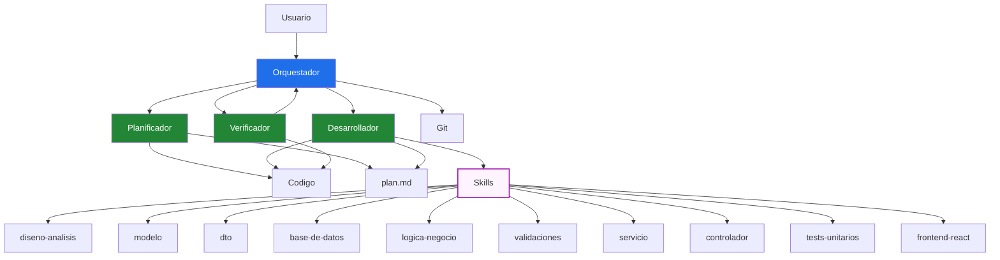
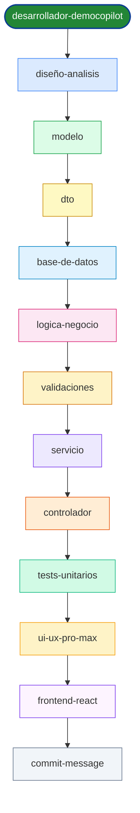
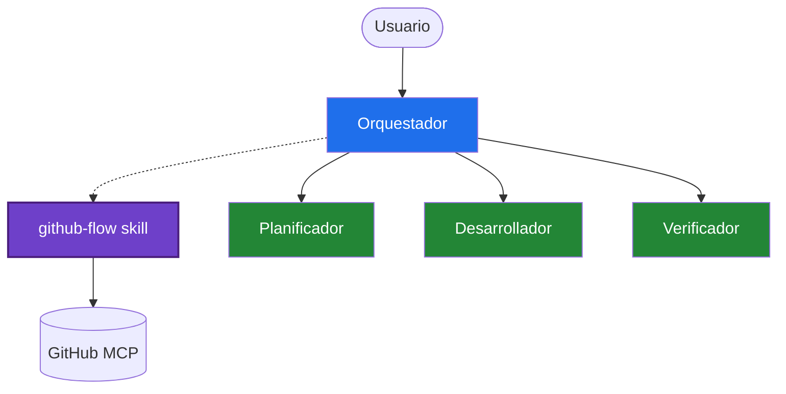
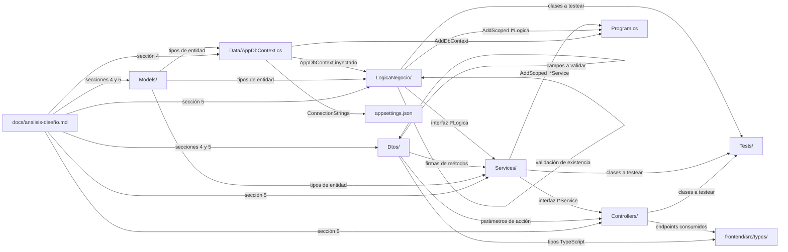
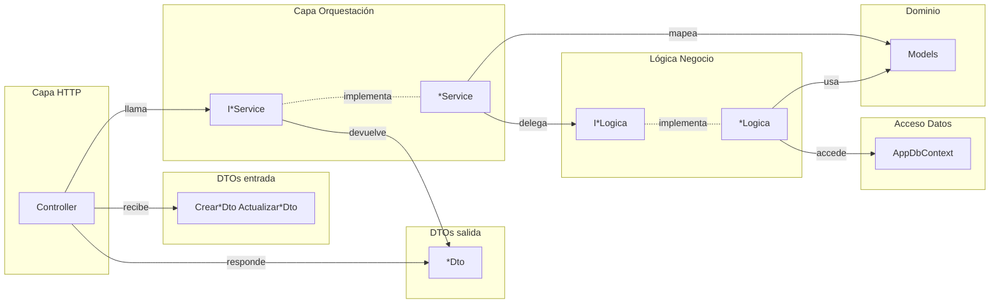
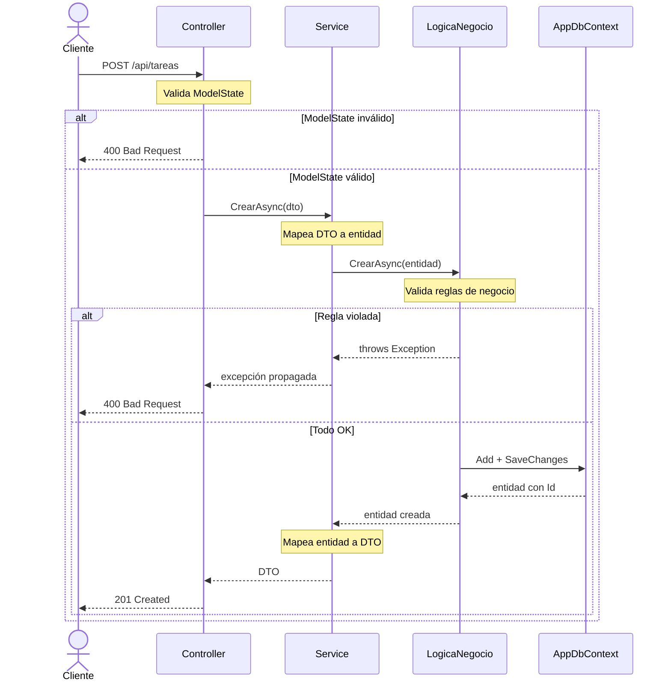
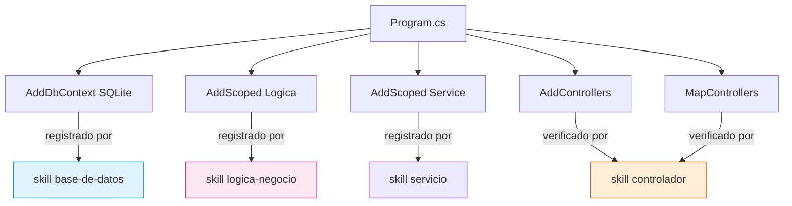
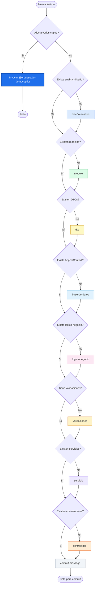

# Orquestación de Skills — DemoCopilot

Este documento describe el conjunto de skills disponibles en el proyecto, su propósito, las dependencias entre ellos y cómo se coordinan para construir la aplicación de forma incremental.

---

## 0. Agentes vs. Skills: la arquitectura completa

Los **skills** son las herramientas. Los **agentes** son quienes las usan.

**Flujo completo:**

1. **Usuario** invoca `@orquestador-democopilot <feature>`
2. **Orquestador** coordina el ciclo completo:
   - Llama a **Planificador** → genera `docs/plan-<slug>.md`
   - Llama a **Desarrollador** → lee el plan e **invoca los skills necesarios en orden**
   - Llama a **Verificador** → comprueba que compila y cumple criterios (bucle hasta 3 iter.)
   - Hace **commit + push** cuando el verificador da APROBADO

**El desarrollador es quien ejecuta los skills** según la tabla de skills del plan (sección 10 del plan). No hay un "orquestador de skills" separado — el agente desarrollador-democopilot lee el plan y va invocando cada skill que corresponda.

---

## 1. Catálogo de skills

| Skill | Carpeta generada | Responsabilidad |
|---|---|---|
| `nueva-feature` | _todas_ | **Implementación completa end-to-end.** Detecta qué capas afecta la feature y orquesta la invocación de todos los skills necesarios en orden. |
| `diseño-analisis` | `docs/` | Documento de análisis y diseño — fuente de verdad de todo lo demás |
| `modelo` | `Models/` | Entidades de dominio (clases C#) |
| `dto` | `Dtos/` | Contratos de entrada y salida de la API |
| `base-de-datos` | `Data/` | AppDbContext, Fluent API, migraciones, seeder |
| `logica-negocio` | `LogicaNegocio/` | Reglas de negocio + acceso a `DbContext` |
| `validaciones` | `Dtos/` + `LogicaNegocio/` | Anotaciones de validación y reglas de dominio |
| `servicio` | `Services/` | Orquestación: mapeo DTO ↔ entidad, delegación a lógica |
| `controlador` | `Controllers/` | Capa HTTP: recibe peticiones, llama al servicio, devuelve respuesta |
| `tests-unitarios` | `Tests/` | **Pruebas unitarias (primer nivel de la pirámide).** Genera proyecto xUnit + Moq si no existe, crea tests para Controllers, Services, LogicaNegocio con patrón AAA, cobertura de casos normales, edge cases, validaciones y errores |
| `ui-ux-pro-max` | — | **VALORAR ANTES DE FRONTEND.** Catálogo de patrones UI/UX, heurísticas de usabilidad, accesibilidad y mejores prácticas para validar diseño antes de escribir código React |
| `frontend-react` | `frontend/` | Frontend React + Vite + TypeScript: tipos, servicios fetch, páginas y componentes |
| `github-flow` | — | **SOLO USADO POR ORQUESTADOR.** Encapsula operaciones GitHub MCP (leer issues, crear ramas, crear PRs, comentar). Usado automáticamente en Modo Issue (`@orquestador-democopilot issue #N`). |
| `actualizar-documentacion` | `docs/` | **Sincronizar docs con código.** Mantiene actualizada la documentación técnica cuando cambian agentes, skills o arquitectura. Corrige diagramas Mermaid problemáticos |
| `commit-message` | — | Genera el mensaje de commit siguiendo convenciones del proyecto |

**Nota:** El skill `github-flow` **no es invocado por el desarrollador**. Es usado directamente por el orquestador cuando detecta un issue de GitHub en el input del usuario. Ver sección 2.5 para detalles.

---

## 2. Flujo de ejecución — orden obligatorio

El **agente desarrollador-democopilot** lee el plan generado por el planificador y ejecuta los skills en el orden especificado en la sección 10 del plan. Para implementaciones completas, el skill `nueva-feature` puede invocar todos los pasos de una vez.

Orden estándar de ejecución:

---

## 2.5. Skill especial: `github-flow` (usado por el orquestador)

El skill `github-flow` **NO forma parte del flujo de desarrollo estándar** de capas. Es un skill auxiliar usado exclusivamente por el **orquestador** en Modo Issue.

**Cuándo se usa:**
- Usuario invoca `@orquestador-democopilot issue #15` o `@orquestador-democopilot #15`
- El orquestador detecta el número de issue
- Invoca `github-flow` para:
  1. Leer el issue desde GitHub
  2. Crear rama `feature/issue-N-<slug>` desde `main`
  3. Crear PR hacia `main` tras implementación exitosa
  4. Comentar en el issue con link al PR

**Arquitectura:**

**El desarrollador nunca invoca `github-flow`** — solo se usa en Modo Issue del orquestador. Los skills de desarrollo (modelo, dto, controlador, etc.) siguen ejecutándose en su orden habitual.

---

## 3. Dependencias entre skills

Cada skill lee los artefactos de los skills anteriores como fuente de verdad. Nunca infiere ni inventa — si el prerequisito no existe, detiene la ejecución.

---

## 4. Arquitectura de capas generada

Una vez ejecutados todos los skills, la aplicación queda estructurada en capas con responsabilidades claramente separadas:

---

## 5. Flujo de una petición en runtime

Cómo viajan los datos desde el cliente HTTP hasta la base de datos y de vuelta, incluyendo las validaciones:

---

## 6. Gestión de `Program.cs`

Cada skill que genera clases registrables actualiza `Program.cs` con los registros de inyección de dependencias. El resultado final queda así:

---

## 7. Cuándo usar cada skill

### Desde los agentes

Lo habitual es invocar **`@orquestador-democopilot <feature>`** y dejar que el ciclo completo se encargue:

1. El **planificador** genera el plan en `docs/plan-<slug>.md`
2. El **desarrollador** lee el plan y ejecuta los skills necesarios en orden
3. El **verificador** comprueba que todo compila y cumple criterios
4. El **orquestador** hace commit + push

### Ejecución manual de skills

Puedes invocar skills individuales cuando necesites actuar sobre una única capa de forma aislada (p. ej. ajustar solo un DTO sin tocar nada más), pero es menos común.

---

## 8. Convenciones de nomenclatura por capa

| Capa | Interfaz | Implementación | Ejemplo |
|---|---|---|---|
| Lógica de negocio | `I<Recurso>Logica` | `<Recurso>Logica` | `ITareaLogica` / `TareaLogica` |
| Servicio | `I<Recurso>Service` | `<Recurso>Service` | `ITareaService` / `TareaService` |
| Controlador | — | `<Recurso>Controller` | `TareasController` |
| DTO entrada crear | — | `Crear<Recurso>Dto` | `CrearTareaDto` |
| DTO entrada actualizar | — | `Actualizar<Recurso>Dto` | `ActualizarTareaDto` |
| DTO salida | — | `<Recurso>Dto` | `TareaDto` |
| Entidad de dominio | — | `<Recurso>` | `TodoItem` |
| Contexto de datos | — | `AppDbContext` | `AppDbContext` |

